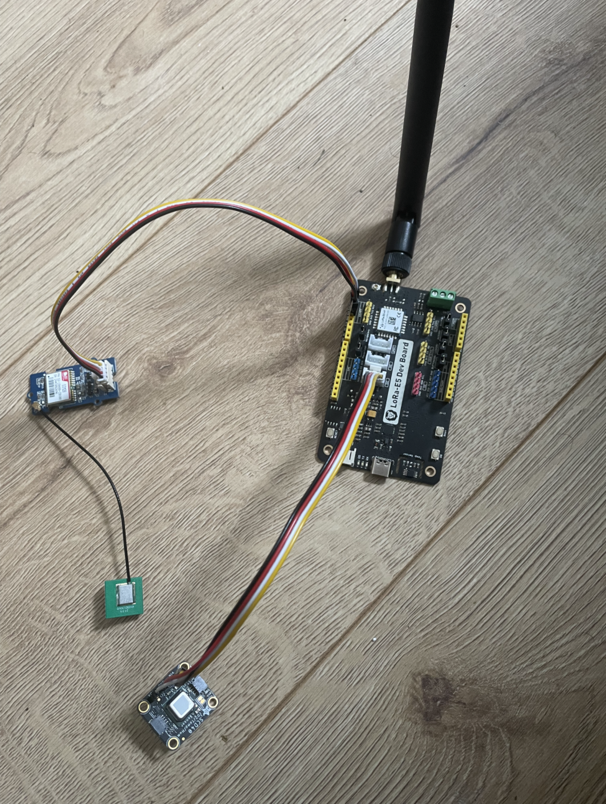

# firewatch-sensor
This repository contains the code for a firewatch module(all components of a sensor put together). The code initializes the co2 sensor, which can also measure humidity and temperature, starts and secures a lorawan connection to the things network, and creates and sends a payload to the things network. The code is in tinygo, which I have had no previous experience in until I started this project.

## Aim of the Project
The goal of this project is to create a prototype for what would be a cluster of sensors in remote areas to detect wildfires. Nowadays there are ever increasing wildfire occurring throughout the world causing billions of dollars in damages. Hopefully this project will be able to notify respective authorities of wildfires and save resources. 

## Hardware Requirements
The following components are required to build the sensor module:

- Lora E5 Devboard: I am using this board since it has a lora RF and mcu chip installed. And for the sake of creating a prototype sensor makes everything easier to have it all in one.
- ST-LINK V2: This is a debugger and programmer for the lora e5 devboard. It is used to flash the code onto the devboard.
- SCD40 Co2, humidity, temperature sensor: The SCD40 is an accurrate sensor that can be used outdoors. It measures co2 directly whereas other sensors approximate it from VOC gas concentration. It also measures humidity and temperature.
- GPS: A GPS module is required to obtain the sensors location. This is important for the sensor to be able to send its location to the things network.

## Software Requirements

The following software tools are required to build the sensor module:

- Tinygo: Tinygo is a go compiler for microcontrollers. It is used to compile the code for the lora e5 devboard.
- Make: Make is a tool that is used to automate the build process. It is used to compile the code for the lora e5 devboard.
- TTN Console: This is a cloud based platform for the LoRaWAN network, which allows the sensor module to communicate with the cloud. The TTN console is used to register the sensor and to obtain the necessary keys to connect to the things network.
- VS Code: VS Code is a code editor that is used to write the code for the sensor module. It is also used to debug the code.


## Wiring the Sensor Module
### SCD40 Sensor
| SCD40 | Lora E5 IIC  |
| --- | -------------- |
| VIN | 3v3            |
| GND | GND            |
| SCL | SCL            |
| SDA | SDA            |

### GPS
| GPS | Lora E5 USART |
| --- | ------------- |
| VCC | 3v3           |
| GND | GND           |
| TX  | RX2           |
| RX  | TX2           |

### ST-LINK V2
| ST-LINK V2 | Lora E5 SWD/SWIM |
| ---------- | ---------------- |
| SWCLK      | CLK              |
| SWDIO      | DIO              |
| GND        | GND              |
| 3v3        | VCC              |

## Sensor Module

This is what it looks like:



## Setup

Follow these steps to setup the environment:
1. Install Tinygo
2. Connect the ST-LINK V2 to the Lora E5 devboard
3. Connect the SCD40 sensor to the Lora E5 devboard
4. Connect the GPS to the Lora E5 devboard
5. Clone this repository
6. Create a TTN application and register the a gateway and end device. Follow the instructions [here](https://www.thethingsnetwork.org/docs/gateways/registration.html)
7. Copy the appkey, appeui, and the deveui keys from the TTN console into a folder called keys, a file with corresponding labels for each key.
8. Run the following command to flash the code onto the lora e5 devboard:

```make``` 

## Usage

The Firewatch sensor module  will continuously measure CO2, temperature, humidity, and location, sending the data to the Things Network every 30 seconds using the LoRaWAN protocol. You can view the data on the TTN Console dashboard.
